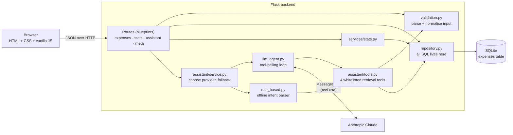
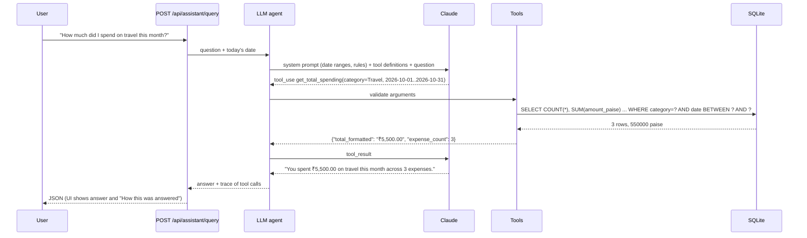

# Architecture

## Overview



Each layer has one job, and dependencies point one way (routes → services → repository → database):

| Layer | File(s) | Responsibility |
|---|---|---|
| HTTP | `app/routes/*.py` | Parse the request, call one service/repository function, shape the response. No SQL, no business rules. |
| Validation | `app/validation.py` | Turn untrusted input (JSON bodies, query strings, AI tool arguments) into clean typed values, or raise a `ValidationError` with per-field messages. |
| Services | `app/services/stats.py`, `app/assistant/*` | Business logic: statistics, the AI assistant. |
| Data access | `app/repository.py` | The only module that contains SQL. Parameterised queries; `ORDER BY` columns come from a whitelist. |
| Storage | `app/schema.sql`, `app/db.py` | Schema with `CHECK` constraints; one connection per request, closed on teardown. |
| Errors | `app/errors.py` | One JSON error envelope for every failure (400, 404, 405, 500, 503). |

## Data model

```sql
expenses (
  id             INTEGER PRIMARY KEY AUTOINCREMENT,
  date           TEXT    -- ISO 8601 'YYYY-MM-DD' (sorts and compares correctly as text)
  category       TEXT    -- one of 7 fixed categories (CHECK constraint)
  description    TEXT    -- 1..255 chars
  amount_paise   INTEGER -- amount in paise (₹1 = 100 paise), > 0
  payment_method TEXT    -- Cash | Card | UPI | Bank Transfer (CHECK constraint)
  created_at     TEXT    -- UTC timestamp, set by the database
  updated_at     TEXT    -- UTC timestamp, refreshed on every update
)
-- indexes: date, category (the columns used for filtering and aggregation)
```

Key decisions:

- **Money as integer paise.** Floats cannot represent most decimal amounts exactly (`0.1 + 0.2 = 0.30000000000000004`). Storing integers makes sums exact. Conversion to rupees happens only at the API boundary, and input parsing uses `Decimal` so `"19.99"` becomes exactly `1999`.
- **Categories and payment methods as constrained text, not lookup tables.** The lists are small and fixed by the brief. `CHECK` constraints give the same integrity guarantee as a foreign key with less complexity. If users needed custom categories, a `categories` table would be the next step.
- **Validation in two places.** The API validates for good error messages; the database `CHECK` constraints are a safety net for data written by other tools.

## AI assistant: retrieve first, then answer

The brief requires that the model does not receive the whole database. The assistant uses **tool calling**: the model is given a description of four narrow retrieval tools, decides which to call, and only the tool results (aggregates or a small, capped set of rows) are sent back to it.



| Tool | Returns | Used for |
|---|---|---|
| `get_total_spending` | total + count for optional date range, category, payment method | "How much…", "How many…" |
| `get_category_breakdown` | per-category totals, counts, percentages | highest category, percentage share, breakdown |
| `get_top_expenses` | up to 20 largest expenses | "three largest expenses" |
| `search_expenses` | up to 25 matching rows + total match count | keyword or filtered lookups |

Safeguards:

- **The model never writes SQL.** It can only pick a tool and supply arguments. Arguments go through the same validation as the REST API (unknown arguments, unknown categories and out-of-range limits are rejected) and then into parameterised queries.
- **Bounded output.** Every tool returns an aggregate or a capped row count, so even a large database never floods the prompt.
- **Pre-computed date ranges.** The system prompt states the exact ranges for "this month", "last month" and "this year". LLMs are unreliable at calendar arithmetic, so the model copies dates instead of computing them.
- **Pre-formatted money.** Tool results include `*_formatted` strings (`₹1,23,456.78`) so the model quotes figures rather than reformatting numbers itself.
- **Errors go back to the model.** Invalid tool arguments return an `is_error` tool result, letting the model correct itself.
- **Bounded loop.** At most 6 model calls per question.
- **Graceful degradation.** With no API key, or if the API fails or times out, the offline rule-based assistant answers using the same tools. The response says which path answered (`provider`, `fallback_reason`).
- **Transparency.** Every answer returns the list of tool calls made; the UI shows it under "How this was answered".

### Rule-based assistant

`rule_based.py` extracts three things with regular expressions: the time period ("this month", "last 7 days", "in March"), categories / payment methods, and an intent (total, count, percentage, highest category, top N, list, breakdown). It then calls the same tools and formats a sentence. It handles the question shapes in the brief and common variations; it is not a general conversational agent, and unrecognised questions get a help message instead of a guess.

## Request lifecycle (CRUD)

1. Route reads JSON (`get_json(silent=True)` → 400 if invalid JSON).
2. `validate_expense_payload` returns normalised values or raises `ValidationError` with all field errors at once.
3. Repository runs a parameterised query and commits.
4. Route returns the resource (`201` + `Location` on create, `204` on delete, `404` if missing).

## Testability

- `create_app(config_overrides)` is an application factory, so each test gets its own temporary SQLite file.
- The current date comes from `app.config["CLOCK"]`, so "this month" is deterministic in tests.
- The Anthropic HTTP transport is injectable (`ANTHROPIC_TRANSPORT`), so the tool-calling loop is tested with scripted fake responses and no network.
